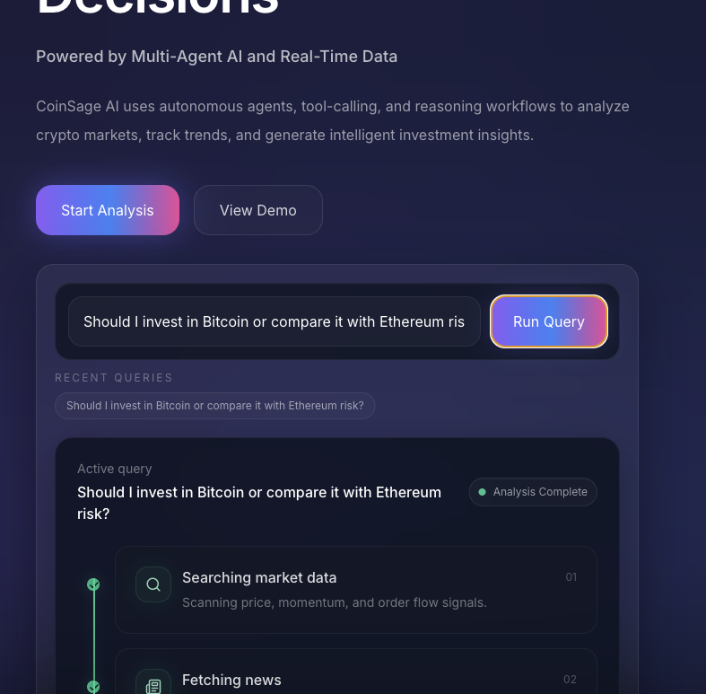
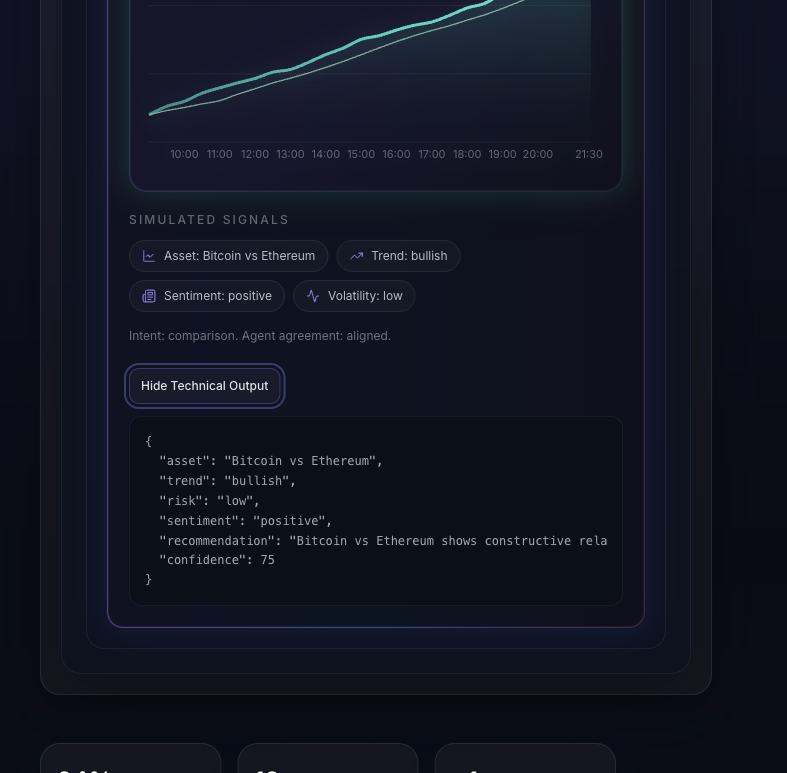
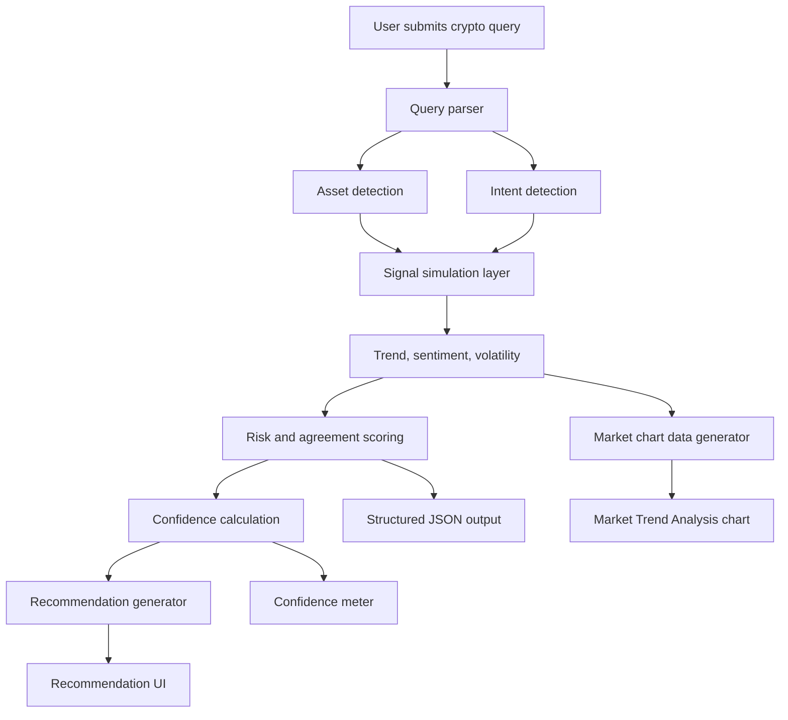

# CoinSage AI

CoinSage AI is an agent-style crypto research interface that simulates how multiple market-analysis agents can turn a user query into a structured investment view. It is built to make the reasoning process visible: the UI shows workflow execution, tool-call logs, simulated market signals, a recommendation, confidence scoring, and a dynamic market trend chart.

> This project uses simulated signals and mock market data for product demonstration. It is not financial advice.

>Demo Link- https://coin-sage-ai-nine.vercel.app/

## Screenshots

### Home and Query Experience


### Dynamic Recommendation and Market Chart



### Optional Technical Output



## What It Does

When a user asks a crypto-market question, CoinSage AI runs a visible research flow:

1. Detects the query context, including asset and intent.
2. Simulates market signals such as trend, sentiment, volatility, and agent agreement.
3. Calculates a confidence score from signal strength and consistency.
4. Generates a context-aware recommendation.
5. Renders a dynamic price-trend chart that matches the generated market view.
6. Optionally exposes the raw structured JSON output for technical users.

The goal is to make the app feel like a real decision-support system rather than a static demo.

## Key Features

- Query-aware recommendation logic for Bitcoin, Ethereum, Solana, Cardano, XRP, Dogecoin, and broad market queries.
- Intent detection for outlook, comparison, risk, and investment-decision prompts.
- Simulated signal layer for trend, sentiment, volatility, and signal agreement.
- Dynamic confidence scoring in realistic bounds.
- Premium Recharts-based market trend chart with area fill, glow styling, moving average, and last-price marker.
- Typewriter-style recommendation reveal.
- Live workflow timeline and tool-call terminal.
- Collapsible technical output with raw structured JSON.
- Dark glassmorphism UI designed for a crypto research dashboard.

## Architecture Flow



## How The System Works

### 1. Query Parser

The parser looks at the user prompt and extracts two important pieces of context:

- **Asset:** examples include Bitcoin, Ethereum, Solana, and broader crypto-market queries.
- **Intent:** outlook, comparison, risk, or investment decision.

This allows the same interface to respond differently to prompts such as:

- "What is the outlook for Bitcoin?"
- "Compare Bitcoin and Ethereum risk."
- "Should I invest in Solana?"
- "How risky is the market right now?"

### 2. Signal Simulation Layer

CoinSage AI generates controlled mock signals from the query:

- **Trend:** bullish, bearish, or neutral.
- **Sentiment:** positive, negative, or mixed.
- **Volatility:** low, medium, or high.
- **Agreement:** aligned, mixed, or conflicted.

The simulation is deterministic enough to feel consistent for a query, but varied enough that different queries produce different outcomes.

### 3. Confidence Engine

Confidence is calculated from the internal signals rather than hard-coded:

```txt
confidence = base score
           + trend strength
           + sentiment strength
           + agreement bonus
           - volatility penalty
```

Aligned signals raise confidence. Conflicted or volatile signals reduce it. The output is kept in a realistic 60-90% range.

### 4. Recommendation Generator

The recommendation changes based on both market signals and user intent:

- A bullish investment query can produce a staged-entry suggestion.
- A high-risk query can recommend caution or reduced exposure.
- A comparison query can frame relative strength and rotation risk.
- Mixed signals lead to more cautious wording.

### 5. Market Trend Chart

The chart is generated from the same agent output:

- Bullish trend creates an upward curve.
- Bearish trend creates a downward curve.
- Neutral trend creates sideways movement.
- Low volatility creates smoother data.
- High volatility creates sharper fluctuations.

The chart includes a gradient area, glow effect, moving average line, tooltip, and last-price marker.

### 6. Technical Output

The raw JSON output is hidden by default to keep the interface clean. Users can open it with the **Show Technical Output** toggle.

Example shape:

```json
{
  "asset": "Bitcoin vs Ethereum",
  "trend": "bullish",
  "risk": "low",
  "sentiment": "positive",
  "recommendation": "Bitcoin vs Ethereum shows constructive relative strength...",
  "confidence": 75
}
```

## Tech Stack

- React 19
- Vite
- Tailwind CSS 4
- Recharts
- Lucide React
- JavaScript

## Getting Started

Install dependencies:

```bash
npm install
```

Run the development server:

```bash
npm run dev
```

Build for production:

```bash
npm run build
```

Preview the production build:

```bash
npm run preview
```

## Project Structure

```txt
.
├── docs/
│   └── screenshots/
│       ├── coinsage-home.png
│       ├── coinsage-analysis.png
│       └── coinsage-technical-output.png
├── scripts/
├── src/
│   ├── App.jsx
│   ├── index.css
│   └── main.jsx
├── index.html
├── package.json
└── vite.config.js
```

## Why This Exists

Most AI demos return a polished answer without showing how that answer was formed. CoinSage AI is designed around transparency: it exposes the research flow, signal inputs, confidence logic, and final structured output so users can understand the reasoning behind a recommendation.

## Contributor

Built and maintained by **prerakarya**.
